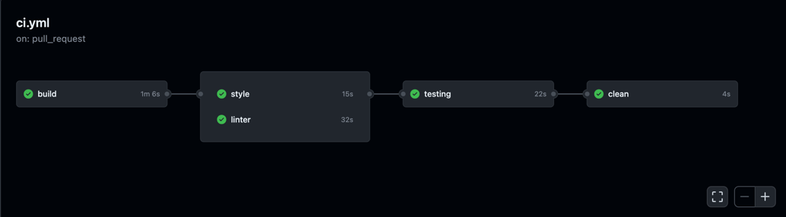
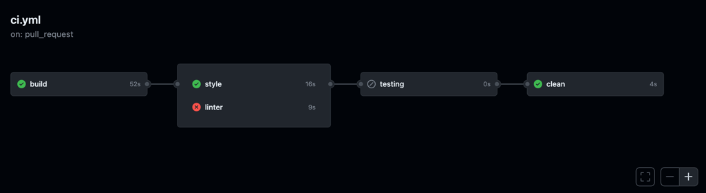

# ♻️ delete-package-container
A GitHub action to delete [ghcr.io](https://ghcr.io) images (GitHub Packages) very useful for cleaning up test images in a pipe, e.g.

## ⚙️ Example to use

```yml
jobs:
  clean:
    runs-on: ubuntu-latest
    steps:
      - name: Delete test image
        uses: albertcolom/delete-package-container@main
        with:
          # Token with correct permissions
          token: ${{ secrets.PAT }}
          # Example format: owner/image_name:tag or image_name:tag
          image: ${{ github.event.repository.name }}/test:tag
```

### 🔐 Secrets

You need define a secret PAT (Personal Access Token) that contain a valid user token with the corrects permission over GitHub Packages.

***NOTE:*** You can find more info about permission on: <https://docs.github.com/en/packages/learn-github-packages/about-permissions-for-github-packages>

## ⚙️ Example of how to use in a pipeline
In this example you can see how create and image for testing propose and how to clean that image when pipe finish or failed to keep your registry clean

```yml
name: CI

on:
  pull_request:
    branches: [ "main" ]

jobs:
  # ...
  # Basic example of how to build and publish an image to ghcr.io from an image of a Dockerfile file
  # ...
  build:
    runs-on: ubuntu-latest
    steps:
      - name: Checkout
        uses: actions/checkout@v3

      - name: Log in to the Container registry
        uses: docker/login-action@v2
        with:
          registry: ghcr.io
          username: ${{ github.actor }}
          password: ${{ secrets.GITHUB_TOKEN }}

      - name: Build testing and push on ghcr.io
        id: docker_build_test
        uses: docker/build-push-action@v3
        with:
          context: .
          platforms: linux/amd64
          file: ./infrastructure/docker/Dockerfile
          push: true
          target: test
          tags: ghcr.io/${{ github.repository }}/test:${{ github.sha }}

  style:
    needs: build
    # ...
  linter:
    needs: build
    # ...
  testing:
    needs: [build, style, linter]
    # ...

  clean:
    needs: [build, testing]
    # Execute always if build step is success
    if: always() && (needs.build.result == 'success')
    runs-on: ubuntu-latest
    steps:
      - name: Delete test image
        uses: albertcolom/delete-package-container@main
        with:
          token: ${{ secrets.PAT }}
          image: ${{ github.event.repository.name }}/test:${{ github.sha }}

```

### 🏖 Screenshots
The pipeline has finished successfully and the image is cleaned up:


The pipeline has failed but the cleanup process is still running because the build step has succeeded:

